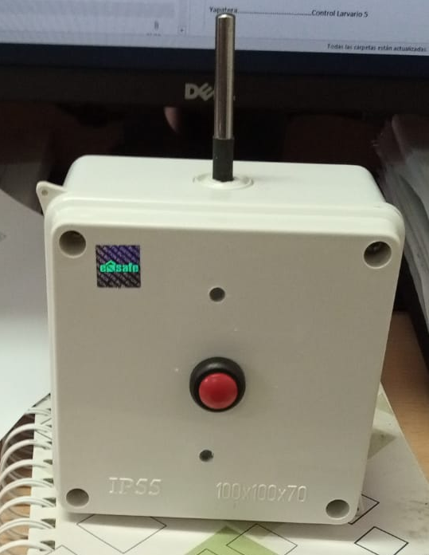
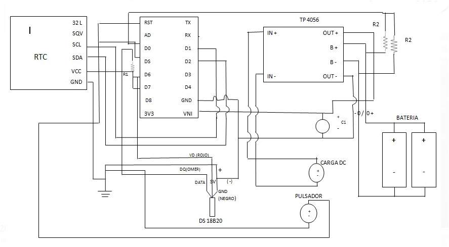

# thermal_aedes
Thermal sensor for aedes aegypti surveillance

We developed a thermal data recording equipment through the Internet of Things (IoT), in order to monitor indoor thermal conditions in localities that do not report the presence of the aedes aegypti vector.

Thermal station:

Circuit (translate in progress)

Code:
modulo_temperatura_v05.ino
